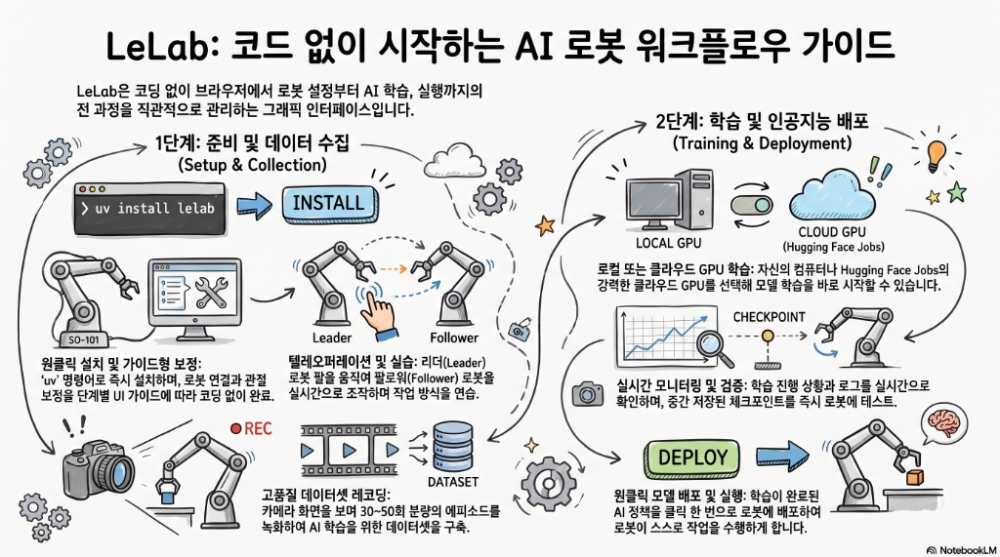

# 🦾 LeLab: 명령줄은 잊으세요
> **LeLab으로 시작하는 ‘코드 한 줄 없는’ 로봇 학습 혁명**

---

## 1. 서론: 로봇 공학의 높은 문턱을 허물다

로봇 공학이라고 하면 흔히 검은 화면에 가득한 복잡한 코드, 끊임없이 터미널에 입력해야 하는 명령어(CLI), 그리고 지난한 캘리브레이션 과정을 떠올리곤 합니다. 이러한 기술적 장벽은 혁신적인 아이디어를 가진 이들조차 로봇 공학의 입구에서 발길을 돌리게 만들었습니다.

하지만 이제 시대가 변했습니다. **LeLab**은 *'박스 개봉부터 학습까지 단 몇 분 만에'*라는 가치를 내걸고, 로봇 학습의 모든 과정을 직관적인 웹 인터페이스로 옮겨왔습니다. 현재 LeLab은 **SO-ARM101**(및 **SO-100** 시리즈)에 최적화되어, 하드웨어 설정부터 AI 모델 배포까지의 복잡한 워크플로우를 하나로 통합했습니다. 이제 당신의 브라우저가 로봇을 가르치는 가장 강력한 도구가 됩니다.

---

## 2. CLI 없이 브라우저에서 끝내는 로봇 워크플로우

LeLab은 **LeRobot** 라이브러리의 강력한 기능을 단일 웹 인터페이스로 통합한 공식 GUI(그래픽 사용자 인터페이스)입니다. 과거에는 각 단계를 실행하기 위해 복잡한 터미널 명령어를 숙지해야 했지만, LeLab은 이를 **"웹 네이티브(Web-native)"** 방식으로 해결했습니다. 파이썬 패키지 관리 도구인 `uv`를 사용하면 단 한 줄의 명령어로 설치와 실행을 동시에 끝낼 수 있습니다.

> [!NOTE]
> *"LeLab은 LeRobot 워크플로우 전체(교정, 텔레오퍼레이션, 녹화, 학습, 재생)를 단일 브라우저 UI에 담은 웹 앱입니다. 팔을 연결하고 앱을 열기만 하면 됩니다. CLI를 통한 복잡한 조작(CLI gymnastics)도, 키보드 프롬프트도 필요 없습니다."*

특히 입문자들이 가장 어려워하는 **'포트 찾기'**와 **'교정(Calibration)'** 과정을 획기적으로 개선했습니다.
* **Unplug-to-detect 기능**: USB 케이블을 뽑았다가 다시 꽂는 것만으로 포트를 자동 인식합니다.
* **시각적 교정 프로세스**: 모든 관절을 중간 위치(Middle position)에 정렬하고 가이드에 따라 움직이기만 하면 끝납니다. 실제 현장에서의 마찰력을 "제로"에 가깝게 줄여줍니다.

---

## 3. 텔레오퍼레이션: 3D 시각화가 만드는 데이터의 정밀도

로봇을 학습시키기 전, 인간의 동작을 로봇에게 전달하는 **'텔레오퍼레이션(Teleoperation)'**은 필수적입니다. LeLab은 **리더-팔로워(Leader-Follower)** 구조를 지원하여, 사용자가 리더 로봇을 움직이면 팔로워 로봇이 이를 실시간으로 복제합니다.

여기서 LeLab의 진가는 **실시간 3D 시각화**에서 드러납니다. 단순히 화면을 보는 것을 넘어, 3D 모델을 통해 실제 환경에서 시야가 가려지는 사각지대(Occlusion)나 로봇 관절의 한계 각도를 직관적으로 파악할 수 있습니다. 

> [!TIP]
> 이는 단순한 시각적 효과가 아닙니다. 사용자가 작업을 **'완벽하고 부드럽게(flawlessly and smoothly)'** 수행하도록 돕는 연습 도구이며, 결국 AI 모델의 성능을 결정짓는 고품질의 데이터를 생성하는 기반이 됩니다.

---

## 4. 고성능 정책의 비밀: '50번의 일관된 반복'과 품질 관리

성공적인 AI 모델(Policy)을 만들기 위해서는 데이터의 '양'보다 **'질'**과 **'일관성'**이 중요합니다. LeLab은 이 과정을 사용자 친화적인 인터페이스로 최적화했습니다.

* **성공적인 학습을 위한 골든 넘버**: LeLab은 하나의 작업을 위해 최소 30회, 안정적인 성능을 위해 **50회의 에피소드 녹화**를 권장합니다. 이는 데이터셋의 노이즈를 줄이고 모델이 동작의 패턴을 확립하기 위한 최적의 수치입니다.
* **실시간 품질 관리**: 녹화 중 실수가 발생했다면 전체를 새로 시작할 필요가 없습니다. 인터페이스의 메뉴나 단축키를 통해 해당 에피소드만 즉시 **재녹화(Re-record)**할 수 있습니다.
* **워크플로우 최적화**: 스페이스바 하나로 에피소드 전환과 환경 리셋 대기 시간을 제어할 수 있어, 펜을 옮기는 것과 같은 작업을 50번 반복하는 데 단 **15분**이면 충분합니다.

---

## 5. 로컬을 넘어 클라우드로: HF Jobs와의 매끄러운 통합

로봇 학습에는 강력한 GPU 자원이 필요합니다. LeLab은 개인 PC 사양의 한계를 **Hugging Face Jobs (HF Jobs)**와의 통합으로 해결했습니다. 터미널에서 `hf auth login`을 통해 한 번만 인증하면, 클릭 몇 번으로 Hugging Face의 클라우드 GPU에서 학습을 시작할 수 있습니다.

이 방식의 강점은 **'확장성'**입니다. 로컬 하드웨어를 점유하지 않고도 여러 학습 세션을 병렬로 실행할 수 있으며, 실시간으로 학습 로그와 손실 수치(Loss)를 모니터링할 수 있습니다. 고가의 워크스테이션 없이도 누구나 최첨단 로봇 AI를 학습시킬 수 있는 소프트웨어 중심의 민주화가 이루어진 것입니다.

---

## 6. 학습 중에 바로 테스트하는 실시간 피드백 루프

LeLab의 가장 혁신적인 기능은 학습이 완전히 종료되기 전에도 **체크포인트를 활용해 즉시 추론(Inference)을 실행**해 볼 수 있다는 점입니다. 이는 며칠씩 걸릴 수 있는 학습 과정에서 잘못된 파라미터로 인한 시간 낭비를 방지해 줍니다.

실제로 **ACT Policy (Action Chunking with Transformers)**를 사용해 학습할 때:
* **3,000 스텝 시점**: 로봇이 펜을 제대로 잡지 못하고 방황할 수 있습니다.
* **30,000 스텝 시점**: 학습이 진행됨에 따라 실시간으로 업데이트되는 체크포인트를 적용해 보면, 로봇이 환경의 미세한 변화에 대응하며 펜을 정확히 집어 드는 '진보의 순간'을 목격하게 됩니다.

이러한 실시간 피드백 루프는 로봇 학습을 지루한 기다림이 아닌 역동적인 실험의 과정으로 바꿔 놓습니다.

---

## 7. 결론: 당신의 책상 위에서 시작될 로봇 시대

LeLab은 오픈 소스 커뮤니티의 열정과 Hugging Face의 기술력이 결합하여 탄생한 결과물입니다. 복잡한 명령줄 환경과 코드의 장벽을 허물고 직관적인 웹 UI를 제공함으로써, 이제 누구나 자신의 책상 위에서 로봇 AI를 연구하고 실현할 수 있는 시대가 열렸습니다.

설치부터 첫 모델의 성공적인 추론까지, LeLab은 당신의 가장 친절한 가이드가 될 것입니다.

---

## 8. 참고 자료 및 관련 링크

* **[📺 LeLab 소개 및 실사용 튜토리얼 영상 (YouTube)](https://youtu.be/VqyKUuW9V1g?si=VR9VXvA3JwxR_E0-)**
* **[GitHub - LeRobot](https://github.com/huggingface/lerobot)**: LeLab의 기반이 되는 핵심 라이브러리
* **[Hugging Face Space - LeLab](https://huggingface.co/spaces/lerobot/LeLab)**: 브라우저에서 직접 UI 체험하기
* **[LeRobot Discord Community](https://discord.gg/q8Dzzpym3f)**: 전 세계 개발자 및 로봇 공학 커뮤니티

---

> **"코드 한 줄 없이 당신의 로봇에게 가르치고 싶은 첫 번째 작업은 무엇인가요? 지금 바로 LeLab과 함께 로봇 공학의 미래에 접속해 보십시오."**
